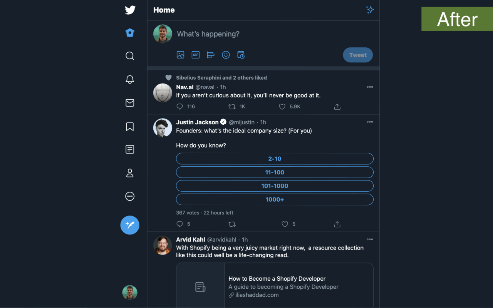

# Simplified Twitter

### The new Twitter, without distractions

#### Download the extension for:

- [Safari](https://apps.apple.com/app/id1479307973?mt=12)
- [Firefox](https://addons.mozilla.org/en-US/firefox/addon/simplified-twitter/)
- [Edge](https://microsoftedge.microsoft.com/addons/detail/simplified-twitter/ngkkffooahinlplicbokppbmhmdglken)
- [Chrome](https://chrome.google.com/webstore/detail/simplified-twitter/kfopmjhmejbgomgeajemgpgpbckpoopg)
- [Other Chromium browsers](https://github.com/brunolemos/simplified-twitter/raw/master/chrome/simplified-twitter-extension.crx) (Opera, Brave, etc)

#### Other links:

- [Tweet](https://twitter.com/brunolemos/status/1154309740694003713?s=20)
- [Product Hunt](https://www.producthunt.com/posts/simplified-twitter)

#### Why is this better than the alternatives?

1. They all make the same mistake: Mess with CSS and make some things worse. Some add shadows, some add distracting hover effects, some move buttons too far away from the center.

2. At the new twitter the class names are random and dynamic (e.g.: `.css-1dbjc4n` instead of `.my-class-name`). Extensions that depend on class names will break at any time.

This extension tricks Twitter to think the window is smaller, and Twitter adjusts everything by itself. We don't need to apply hacky styles, twitter is already responsive by default.

> "I've tried a lot of similar extensions, and this one provides the best result."

> "Literally 10/10"

### Author

Follow me on Twitter: [@brunolemos](https://twitter.com/brunolemos)

